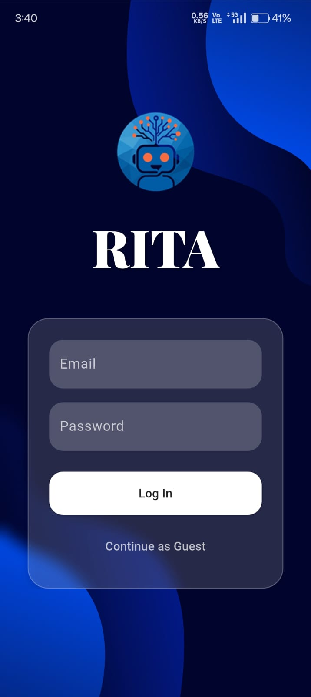
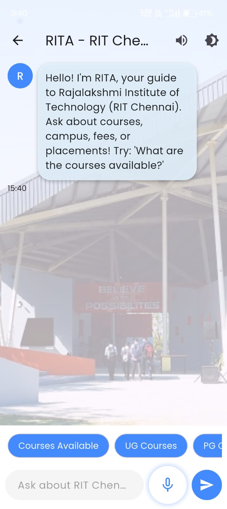
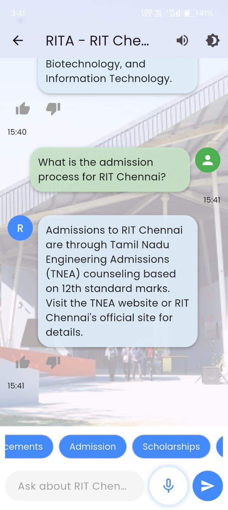

# 🤖 RITA - Rajalakshmi Institute Technology Assistant

Welcome to **RITA**, an AI-powered interactive chatbot designed for the students and staff of **Rajalakshmi Institute of Technology**. This assistant can answer academic and administrative FAQs, provide event updates, assist with course-related information, and even help navigate campus facilities.

---

## 🎯 Project Motivation

This project was built to solve a common issue on college campuses — students often struggle to find up-to-date, accurate information related to syllabus, faculty contacts, fees, admissions, internal queries, and club events.

Rather than relying on manual responses or digging through cluttered portals, **RITA** acts as a centralized, intelligent FAQ & assistant system. It’s especially helpful for **first-year students** and guests who need quick guidance.

---

## 🧠 What I Learned

Through this project, I gained hands-on experience and deep understanding in the following areas:

- 🤖 Natural Language Processing (NLP)  
- 🧩 Model fine-tuning (LoRA-based approach with open-source models)  
- 🛠️ Backend-Frontend Integration (Python + Flutter)  
- 🔥 Firebase Authentication and Firestore usage  
- ⚙️ YAML configuration and secure API handling  
- 🌐 Git version control and open-source documentation  
- 🎨 UI/UX design with Flutter animations  

---

## 🛠️ Technologies Used

- **Frontend**: Flutter (with animated UI for login and chat)
- **Backend**: Python (FastAPI for chatbot API)
- **Database**: Firebase (Auth, Firestore)
- **Model**: Fine-tuned LLM (Phi-2 or similar lightweight model)
- **Configuration**: YAML for API and system-level settings
- **Hosting**: Localhost/API testing; optionally deployable to Render or Firebase Functions

---

## 💡 Features

- 🔐 **Guest Mode**: Limited access to public FAQs and general queries  
- 🧑‍💼 **Student Login**: Unlocks personalized features like class updates, assignments, and club registrations  
- 📚 **Course Info**: Subject-wise syllabus, exam patterns, and notes  
- 📅 **Event Calendar**: Dynamic updates on upcoming college events and registrations  
- 🧭 **Campus Navigation Help**: Department locations, canteen, auditorium, etc.  
- 🧠 **Smart Query**: Handles flexible natural-language questions  
- 🧑‍🔧 **Admin Panel** (future update): For content updates and control  

---

## 📷 Screenshots


> Glimpse of our elegant and animated UI.

<div align="center">

  

  

  

</div>


## ⚙️ How to Set Up and Use Locally

### 1. Clone the Repo
```bash
git clone https://github.com/your-username/rita-chatbot.git
cd rita-chatbot
